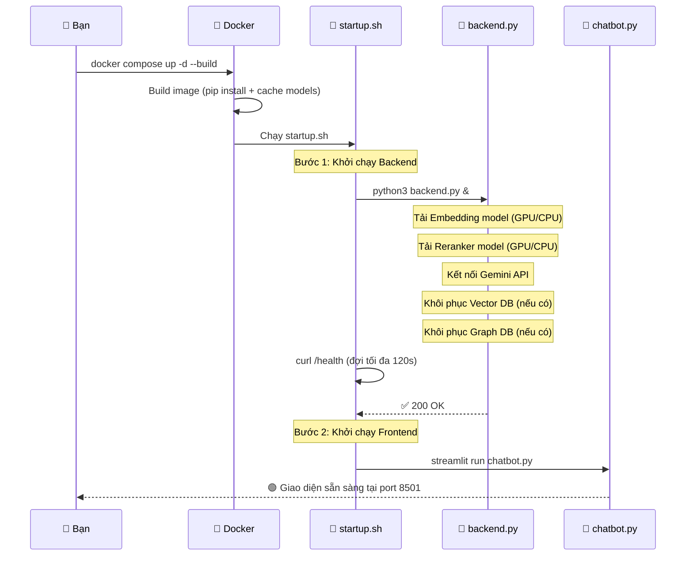
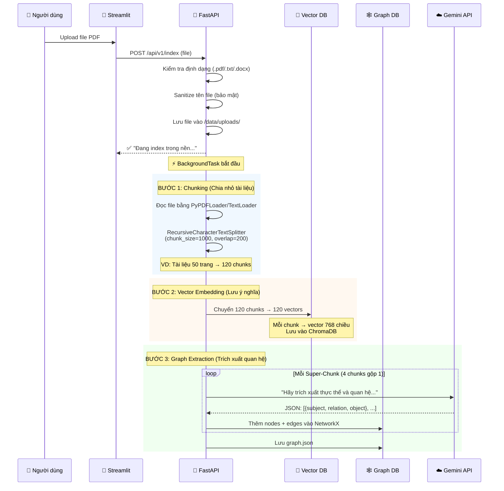
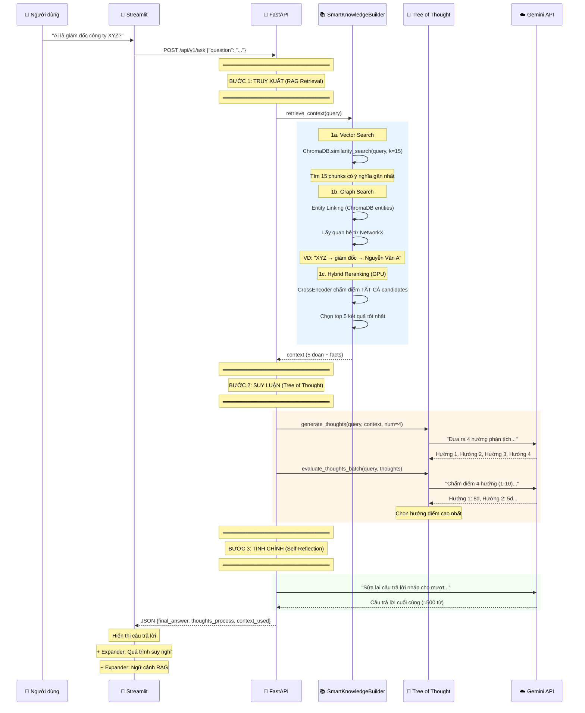
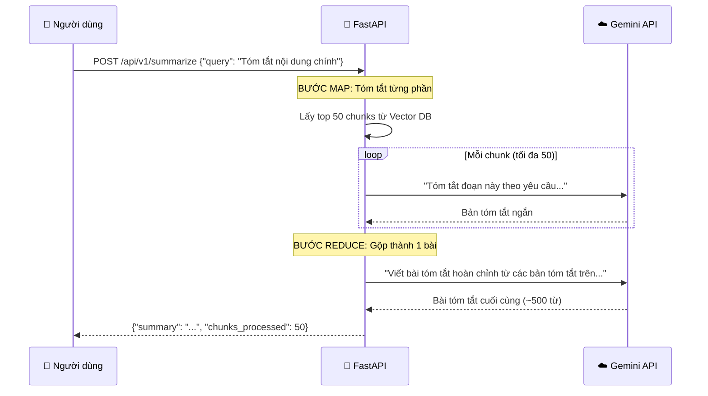

# 🧭 Code Flow — Luồng Hoạt Động Chi Tiết

> Tài liệu này giải thích **từng bước** cách hệ thống ChatBotColab hoạt động.
> Đọc xong bạn sẽ hiểu toàn bộ kiến trúc và dòng chảy dữ liệu.

---

## 📐 Tổng Quan Kiến Trúc

Hệ thống gồm **2 phần chính** chạy trong cùng 1 Docker container:

```
┌─────────────────────────────────────────────────────────┐
│                   Docker Container                       │
│                                                          │
│  ┌──────────────┐          ┌──────────────────────────┐ │
│  │  chatbot.py   │  HTTP   │  backend.py               │ │
│  │  (Streamlit)  │ ◄─────► │  (FastAPI)                │ │
│  │  Port 8501    │         │  Port 8000                │ │
│  └──────────────┘          │                           │ │
│                             │  ┌─────────────────────┐ │ │
│                             │  │ SmartKnowledgeBuilder│ │ │
│                             │  │  • Vector DB (Chroma)│ │ │
│                             │  │  • Graph DB (NetworkX)│ │ │
│                             │  │  • Reranker (GPU)    │ │ │
│                             │  └─────────────────────┘ │ │
│                             │                           │ │
│                             │  ┌─────────────────────┐ │ │
│                             │  │AdvancedReasoningAgent│ │ │
│                             │  │  • Gemini API (Cloud)│ │ │
│                             │  │  • Tree of Thought   │ │ │
│                             │  │  • Self-Reflection   │ │ │
│                             │  │  • Map-Reduce        │ │ │
│                             │  └─────────────────────┘ │ │
│                             └──────────────────────────┘ │
│                                                          │
│  📂 /app/data/                                           │
│     ├── vector_db/    ← ChromaDB embeddings              │
│     ├── graph.json    ← Knowledge Graph (NetworkX)       │
│     ├── documents/    ← Tài liệu gốc                    │
│     └── uploads/      ← File upload từ user              │
└─────────────────────────────────────────────────────────┘
```

### Giải thích đơn giản:

| Thành phần | Vai trò | Ví dụ dễ hiểu |
|---|---|---|
| **chatbot.py** | Giao diện người dùng | Như "cửa hàng" — nơi khách hàng tương tác |
| **backend.py** | Bộ não xử lý | Như "nhà bếp" — nơi chế biến câu trả lời |
| **Vector DB** | Kho lưu ý nghĩa văn bản | Như "tủ hồ sơ" — tìm tài liệu theo nội dung |
| **Graph DB** | Bản đồ quan hệ thực thể | Như "sơ đồ gia phả" — ai liên quan đến ai |
| **Gemini API** | Bộ não suy luận (Cloud) | Như "chuyên gia tư vấn" — đọc tài liệu và trả lời |

---

## 📁 Bản Đồ File — Mỗi File Làm Gì?

```
chatbotwithcolab/
│
├── backend.py              ← 🧠 BỘ NÃO: Server API + RAG + AI reasoning
│   ├── Section 0: Cấu hình Logging
│   ├── Section 1: Nạp biến môi trường (.env)
│   ├── Section 1.5: GraphRAGBuilder (đồ thị tri thức)
│   ├── Section 2: SmartKnowledgeBuilder (Vector + Graph + Reranker)
│   ├── Section 3: AdvancedReasoningAgent (Gemini + ToT)
│   ├── Section 4: Khởi tạo các module toàn cục
│   ├── Section 5: FastAPI endpoints (/ask, /index, /summarize)
│   └── Section 6: Main entry point (uvicorn)
│
├── chatbot.py              ← 🎨 GIAO DIỆN: Chat UI + Upload file
│   ├── Section 1: Cấu hình kết nối (API URL, sidebar)
│   ├── Section 2: Quản lý session state (lịch sử chat)
│   └── Section 3: Xử lý câu hỏi → gọi API → hiển thị kết quả
│
├── startup.sh              ← 🚀 KHỞI ĐỘNG: Chạy backend → chờ ready → chạy frontend
├── Dockerfile              ← 📦 ĐÓNG GÓI: Build image + pre-cache models
├── docker-compose.yml      ← 🐳 TRIỂN KHAI: Config ports, volumes, resources
├── requirements.txt        ← 📋 THƯ VIỆN: Danh sách Python packages
├── .env                    ← 🔑 BÍ MẬT: API keys, cấu hình server
└── .gitignore              ← 🚫 LOẠI TRỪ: Không commit data/, .env, __pycache__
```

---

## 🔄 Luồng 1: Khởi Động Hệ Thống

> Khi bạn chạy `docker compose up`, điều gì xảy ra?



### Chi tiết khởi tạo `backend.py` (theo thứ tự):

| Bước | Code (Line) | Hành động | Thời gian |
|---|---|---|---|
| 1 | `logging.basicConfig(...)` | Cấu hình log format | Tức thì |
| 2 | `load_dotenv()` | Đọc file `.env` → lấy GEMINI_API_KEY, paths... | Tức thì |
| 3 | `SmartKnowledgeBuilder()` | Tải model Embedding + Reranker vào RAM/GPU | ~10-30s |
| 4 | → `GraphRAGBuilder()` | Khôi phục đồ thị tri thức từ `graph.json` | ~1s |
| 5 | `AdvancedReasoningAgent()` | Test kết nối Gemini API (gửi "1+1=?") | ~2s |
| 6 | `uvicorn.run(app)` | Mở server FastAPI tại port 8000 | Tức thì |

---

## 🔄 Luồng 2: Upload & Index Tài Liệu

> Khi bạn upload file PDF, hệ thống xây dựng "bộ nhớ" như thế nào?



### Giải thích quá trình Chunking:

```
📄 Tài liệu gốc (dài):
"Nguyễn Văn A là giám đốc công ty XYZ. Công ty XYZ được thành lập năm 2020
tại Hà Nội. XYZ chuyên về công nghệ AI..."

        ↓ RecursiveCharacterTextSplitter ↓

📦 Chunk 1 (1000 ký tự):               📦 Chunk 2 (1000 ký tự):
"Nguyễn Văn A là giám đốc              "...tại Hà Nội. XYZ chuyên
 công ty XYZ. Công ty XYZ               về công nghệ AI..."
 được thành lập năm 2020..."
                                         ← overlap 200 ký tự →
```

### Giải thích quá trình Graph Extraction:

```
📦 Chunk input:
"Nguyễn Văn A là giám đốc công ty XYZ. XYZ thành lập năm 2020 tại Hà Nội."

        ↓ Gemini API trích xuất ↓

🕸️ Knowledge Graph:
    [Nguyễn Văn A] ──là giám đốc của──► [XYZ]
    [XYZ] ──thành lập vào──► [2020]
    [XYZ] ──nằm ở──► [Hà Nội]
```

---

## 🔄 Luồng 3: Hỏi - Đáp (Pipeline Chính)

> Đây là luồng quan trọng nhất — khi người dùng đặt câu hỏi.



### Tóm tắt 3 bước bằng phép so sánh:

| Bước | Kỹ thuật | Ví dụ dễ hiểu |
|---|---|---|
| **1. RAG Retrieval** | Vector + Graph + Reranker | 📖 Tra cứu sách tham khảo → chọn trang liên quan nhất |
| **2. Tree of Thought** | Sinh 4 hướng → chấm điểm → chọn | 🤔 Nghĩ 4 cách trả lời → đánh giá → chọn cách hay nhất |
| **3. Self-Reflection** | LLM tự kiểm tra và sửa | ✍️ Đọc lại bài viết → sửa lỗi → nộp bản hoàn chỉnh |

### Số lần gọi Gemini API cho 1 câu hỏi:

| Lần gọi | Hàm | Mục đích |
|---|---|---|
| 1 | `generate_thoughts()` | Sinh 4 hướng suy luận |
| 2 | `evaluate_thoughts_batch()` | Chấm điểm tất cả (gộp 1 lần) |
| 3 | `self_reflect()` | Tinh chỉnh câu trả lời |
| **Tổng** | **3 API calls** | Tối ưu (trước đó là 7 calls) |

---

## 🔄 Luồng 4: Tóm Tắt Tài Liệu (Map-Reduce)

> Khi cần tóm tắt toàn bộ tài liệu, không chỉ trả lời 1 câu hỏi.



### So sánh Map-Reduce:

```
Ví dụ: Tóm tắt sách 300 trang

📗 MAP (Chia để trị):
  Chương 1 → Tóm tắt 1
  Chương 2 → Tóm tắt 2
  Chương 3 → Tóm tắt 3
  ...

📘 REDUCE (Gộp lại):
  Tóm tắt 1 + 2 + 3 + ... → BÀI TÓM TẮT HOÀN CHỈNH
```

---

## 🎨 Luồng Frontend (chatbot.py) Chi Tiết

### Đặc điểm quan trọng của Streamlit:

> ⚠️ **Mỗi khi bạn tương tác (bấm nút, nhập text), Streamlit chạy lại TOÀN BỘ script từ đầu.**
> Vì vậy phải dùng `st.session_state` để nhớ lịch sử chat.

```python
# Ví dụ: Nếu KHÔNG dùng session_state
# Lần 1: User hỏi → Bot trả lời → Hiển thị OK
# Lần 2: User hỏi tiếp → Script chạy lại → Mất sạch lịch sử!

# Giải pháp: Dùng session_state
st.session_state.messages = []  # Lưu lại giữa các lần rerun
```

### Cấu trúc giao diện:

```
┌──────────────────────────────────────────┐
│ 📱 SIDEBAR (Bên trái)                    │
│ ┌──────────────────────────────────────┐ │
│ │ ⚙️ Cấu hình                          │ │
│ │ API URL: [http://localhost:8000/...] │ │
│ ├──────────────────────────────────────┤ │
│ │ 📄 Upload Tài liệu                   │ │
│ │ [Chọn file PDF/TXT/DOCX]            │ │
│ │ [📥 Index tài liệu]                 │ │
│ ├──────────────────────────────────────┤ │
│ │ [🩺 Kiểm tra Server]                │ │
│ └──────────────────────────────────────┘ │
├──────────────────────────────────────────┤
│ 💬 MAIN CHAT AREA (Bên phải)             │
│                                          │
│ 👤 User: "Ai là giám đốc XYZ?"          │
│                                          │
│ 🤖 Bot:                                 │
│   ### 🎯 Trả lời:                       │
│   Nguyễn Văn A là giám đốc...           │
│                                          │
│   ▸ 🧠 Xem quá trình suy nghĩ (ToT)    │
│   ▸ 📚 Xem tài liệu trích xuất (RAG)   │
│                                          │
│ ┌──────────────────────────────────────┐ │
│ │ Hãy hỏi tôi về Data Science...      │ │
│ └──────────────────────────────────────┘ │
└──────────────────────────────────────────┘
```

---

## 🔑 Biến Môi Trường (.env)

| Biến | Bắt buộc | Mặc định | Mô tả |
|---|---|---|---|
| `GEMINI_API_KEY` | ✅ Có | — | API key từ [Google AI Studio](https://aistudio.google.com/apikey) |
| `GEMINI_MODEL` | ❌ | `gemini-2.0-flash` | Tên model Gemini (có thể đổi sang `gemini-2.5-flash-lite`) |
| `DATABASE_PATH` | ❌ | `./data/vector_db` | Nơi lưu ChromaDB |
| `BACKEND_HOST` | ❌ | `0.0.0.0` | Host server lắng nghe |
| `BACKEND_PORT` | ❌ | `8000` | Port FastAPI |
| `STREAMLIT_PORT` | ❌ | `8501` | Port Streamlit |
| `ALLOWED_ORIGINS` | ❌ | `http://localhost:8501` | CORS origins (phân cách bằng dấu `,`) |
| `DOC_PATH` | ❌ | — | Đường dẫn file tài liệu (auto-index khi khởi động) |

---

## 📡 API Endpoints Cheat Sheet

### `GET /health` — Kiểm tra hệ thống

```bash
curl http://localhost:8000/health
```
```json
{
  "status": "ok",
  "gemini_connected": true,
  "model_name": "gemini-2.0-flash",
  "vector_db_ready": true
}
```

### `POST /api/v1/ask` — Hỏi đáp (Rate limit: 10 req/phút)

```bash
curl -X POST http://localhost:8000/api/v1/ask \
  -H "Content-Type: application/json" \
  -d '{"question": "Ai là giám đốc công ty XYZ?"}'
```
```json
{
  "final_answer": "Theo tài liệu, Nguyễn Văn A là giám đốc...",
  "thoughts_process": ["Hướng 1: ...", "Hướng 2: ..."],
  "context_used": "Đoạn trích từ tài liệu..."
}
```

### `POST /api/v1/index` — Upload tài liệu

```bash
curl -X POST http://localhost:8000/api/v1/index \
  -F "file=@tai_lieu.pdf"
```
```json
{
  "status": "success",
  "message": "Tài liệu đang được lập chỉ mục trong nền...",
  "chunks_count": 120
}
```

### `POST /api/v1/summarize` — Tóm tắt tài liệu

```bash
curl -X POST http://localhost:8000/api/v1/summarize \
  -H "Content-Type: application/json" \
  -d '{"query": "Tóm tắt nội dung chính"}'
```
```json
{
  "summary": "Tài liệu trình bày về...",
  "chunks_processed": 50
}
```

---

## 🛡️ Các Cơ Chế Bảo Vệ

| Cơ chế | Thư viện | Mục đích |
|---|---|---|
| **Rate Limiting** | `slowapi` | Tối đa 10 req/phút cho `/api/v1/ask` |
| **Retry Logic** | `tenacity` | Tự động thử lại 3 lần khi Gemini API lỗi |
| **CORS** | FastAPI middleware | Chỉ cho phép origins trong `ALLOWED_ORIGINS` |
| **Path Traversal** | `re.sub()` | Sanitize tên file upload (chặn `../../etc/passwd`) |
| **Healthcheck** | Docker HEALTHCHECK | Tự restart nếu backend chết |
| **Graceful Shutdown** | `trap SIGTERM` | Tắt backend trước khi Docker stop container |

---

## 🐛 Debug — Khi Gặp Lỗi Thường Gặp

| Triệu chứng | Nguyên nhân | Cách sửa |
|---|---|---|
| "Gemini API chưa kết nối" | Thiếu `GEMINI_API_KEY` trong `.env` | Lấy key tại [aistudio.google.com/apikey](https://aistudio.google.com/apikey) |
| "Không tìm thấy thông tin" | Chưa upload tài liệu nào | Upload PDF/TXT/DOCX qua sidebar |
| Timeout (3 phút) | Tài liệu quá lớn hoặc Gemini API chậm | Chờ hoặc chia nhỏ tài liệu |
| 429 Too Many Requests | Vượt rate limit 10 req/phút | Đợi 1 phút rồi thử lại |
| "Vector DB not ready" | Index đang chạy nền | Đợi vài phút, kiểm tra logs |
| Container không lên | Port 8000/8501 bị chiếm | `docker compose down` rồi thử lại |

### Xem logs:
```bash
docker compose logs -f          # Xem tất cả logs
docker compose logs -f chatbot  # Chỉ xem log container chatbot
```

---

## 📊 Hiệu Năng & Chi Phí

| Metric | Giá trị |
|---|---|
| Thời gian khởi động | ~30s (models đã pre-cached trong Docker image) |
| Thời gian trả lời 1 câu hỏi | ~10-40s (3 Gemini API calls) |
| Thời gian index 1 PDF 50 trang | ~2-5 phút (chạy nền, không block UI) |
| Gemini API calls / câu hỏi | 3 calls |
| Chi phí Gemini API / câu hỏi | ~$0.003 (rất rẻ) |
| RAM cần thiết | ~2-4 GB (Embedding + Reranker models) |
