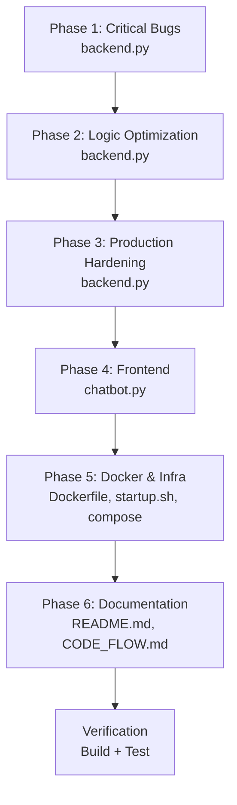

# 🔍 MLOps Optimization Plan — ChatBotColab (GCP Deployment)

> **Status:** ✅ Finalized — Chờ approval để bắt đầu triển khai  
> **Quyết định đã xác nhận:**  
> - Q1: Giữ `map_reduce_summarize()` → tạo endpoint `/api/v1/summarize`  
> - Q2: GCP Project ID + Vertex AI API đã sẵn sàng  
> - Q3: Rate limit = 10 req/min cho `/api/v1/ask`  
> - Q4: Giữ phần Colab trong README  

---

## Tổng quan

Audit phát hiện **20 issues** (7 bugs, 5 performance, 8 production-readiness). Plan này chia thành **6 phases** theo thứ tự ưu tiên — fix critical bugs trước, optimization sau.

### Impact dự kiến

| Metric | Trước | Sau | Cải thiện |
|---|---|---|---|
| API calls/question | 7 | 2-3 | ~60% giảm |
| Latency/question | 30-120s | 10-40s | ~60% nhanh hơn |
| Vertex AI cost/question | ~$0.007 | ~$0.003 | ~60% tiết kiệm |
| Docker image startup | ~2-3 phút | ~30s | ~80% nhanh hơn |
| Concurrent request handling | ❌ blocked | ✅ non-blocking | — |

---

## Phase 1: Critical Bug Fixes (backend.py)

> [!CAUTION]
> Hai bug này gây **mất dữ liệu** và **server treo** — phải fix đầu tiên.

### 1.1 BUG-1: `process_and_save()` ghi đè Vector DB

**File:** [backend.py](file:///d:/ChatBotColab/backend.py#L86-L117)  
**Severity:** 🔴 CRITICAL — Data loss

**Hiện tại:**
```python
# Line 112-116: Mỗi lần upload → XÓA SẠCH DB cũ, tạo mới
self.vector_db = Chroma.from_documents(
    documents=chunks,
    embedding=self.embedding_model,
    persist_directory=self.db_path,
)
```

**Sửa thành:**
```diff
- self.vector_db = Chroma.from_documents(
-     documents=chunks,
-     embedding=self.embedding_model,
-     persist_directory=self.db_path,
- )
+ if self.vector_db:
+     # Incremental: thêm chunks mới vào DB đã có
+     self.vector_db.add_documents(chunks)
+ else:
+     # Lần đầu: tạo DB mới
+     self.vector_db = Chroma.from_documents(
+         documents=chunks,
+         embedding=self.embedding_model,
+         persist_directory=self.db_path,
+     )
```

---

### 1.2 BUG-5: `async def` + blocking calls → Event loop bị block

**File:** [backend.py](file:///d:/ChatBotColab/backend.py#L340-L375)  
**Severity:** 🔴 CRITICAL — Server treo khi có concurrent requests

**Vấn đề:** `async def ask_vistral()` gọi toàn bộ blocking code bên trong (ChromaDB search, Gemini API calls). Khi 1 user đang hỏi (30-120s), tất cả user khác phải **đợi** vì event loop bị block.

**Sửa thành:**
```diff
- @app.post("/api/v1/ask", response_model=QueryResponse)
- async def ask_vistral(request: QueryRequest):
+ @app.post("/api/v1/ask", response_model=QueryResponse)
+ def ask_vistral(request: QueryRequest):
```

Tương tự cho `index_document`:
```diff
- async def index_document(file: UploadFile = File(...)):
+ def index_document(file: UploadFile = File(...)):
```

> [!NOTE]
> Khi dùng `def` (sync), FastAPI tự động chạy trong threadpool → không block event loop. Đây là best practice khi handler có blocking I/O.
> Riêng `health_check()` giữ `async def` vì nó không blocking.

---

### 1.3 BUG-6: Path Traversal Attack qua filename

**File:** [backend.py](file:///d:/ChatBotColab/backend.py#L396)  
**Severity:** 🟡 MEDIUM — Security vulnerability

**Sửa thành:**
```diff
+ import re
  
- file_path = upload_dir / file.filename
+ # Sanitize filename: chỉ giữ alphanumeric, dấu chấm, gạch ngang, gạch dưới
+ safe_name = re.sub(r'[^\w\-.]', '_', os.path.basename(file.filename))
+ if not safe_name or safe_name.startswith('.'):
+     raise HTTPException(status_code=400, detail="Tên file không hợp lệ")
+ file_path = upload_dir / safe_name
```

---

## Phase 2: Logic & Performance Optimization (backend.py)

### 2.1 PERF-1: Gộp evaluate_thoughts từ 5 API calls → 1 API call

**File:** [backend.py](file:///d:/ChatBotColab/backend.py#L206-L221)  
**Impact:** Giảm 4 API calls/question, tiết kiệm ~12-20 giây latency

**Hiện tại:** Loop 5 lần, mỗi lần gọi Gemini 1 lần → 5 calls tuần tự.

**Sửa thành:** 1 prompt duy nhất yêu cầu LLM chấm điểm tất cả:

```python
def evaluate_thoughts_batch(self, query, thoughts, context):
    """Chấm điểm tất cả thoughts trong 1 lần gọi API duy nhất."""
    thoughts_text = "\n".join(
        f"Hướng {i+1}: {t}" for i, t in enumerate(thoughts)
    )
    prompt = (
        f"Ngữ cảnh: {context}\n"
        f"Câu hỏi: {query}\n\n"
        f"Các hướng giải quyết:\n{thoughts_text}\n\n"
        f"Nhiệm vụ: Đánh giá mỗi hướng có phù hợp với ngữ cảnh không. "
        f"Chấm điểm 1-10 cho từng hướng.\n"
        f"Xuất ra ĐÚNG FORMAT: mỗi dòng là 'Hướng X: Y điểm' (Y là số nguyên).\n"
        f"Ví dụ:\nHướng 1: 8 điểm\nHướng 2: 5 điểm"
    )
    raw_text = self._call_llm(prompt, temperature=0.0, max_output_tokens=200)
    
    # Parse scores
    best_idx, best_score = 0, -1
    for line in raw_text.strip().split("\n"):
        digits = re.findall(r'\d+', line)
        if len(digits) >= 2:
            idx = int(digits[0]) - 1
            score = min(int(digits[1]), 10)
            if 0 <= idx < len(thoughts) and score > best_score:
                best_score = score
                best_idx = idx
    
    return thoughts[best_idx]
```

---

### 2.2 BUG-3: Score parsing validation

**Đã xử lý trong 2.1** — Batch scoring có format rõ ràng hơn, parse cũng robust hơn.

---

### 2.3 PERF-2: Giảm reranker workload

**File:** [backend.py](file:///d:/ChatBotColab/backend.py#L119)

```diff
- def retrieve_context(self, query, top_k_vector=30, final_k=5):
+ def retrieve_context(self, query, top_k_vector=15, final_k=5):
```

**Impact:** Reranker xử lý 15 pairs thay vì 30 → nhanh gấp ~2x trên CPU.

---

### 2.4 BUG-4: Tạo endpoint cho `map_reduce_summarize()`

**File:** [backend.py](file:///d:/ChatBotColab/backend.py) — thêm mới

```python
class SummarizeRequest(BaseModel):
    query: str

class SummarizeResponse(BaseModel):
    summary: str
    chunks_processed: int

@app.post("/api/v1/summarize", response_model=SummarizeResponse)
def summarize_documents(request: SummarizeRequest):
    """Tóm tắt toàn bộ tài liệu theo yêu cầu (Map-Reduce)"""
    if global_agent is None:
        raise HTTPException(status_code=503, detail="Gemini API chưa kết nối")
    if not global_knowledge_base.vector_db:
        raise HTTPException(status_code=404, detail="Chưa có tài liệu nào")
    
    # Lấy tất cả chunks từ DB
    all_docs = global_knowledge_base.vector_db.similarity_search(
        request.query, k=50
    )
    chunk_texts = [doc.page_content for doc in all_docs]
    
    summary = global_agent.map_reduce_summarize(request.query, chunk_texts)
    return SummarizeResponse(
        summary=summary,
        chunks_processed=len(chunk_texts)
    )
```

---

## Phase 3: Production Hardening (backend.py)

### 3.1 PROD-2: Structured Logging (thay thế `print()`)

Thay toàn bộ `print()` bằng `logging` module:

```python
import logging

logging.basicConfig(
    level=logging.INFO,
    format="%(asctime)s [%(levelname)s] %(name)s: %(message)s",
    datefmt="%Y-%m-%d %H:%M:%S",
)
logger = logging.getLogger("chatbot-colab")
```

**Mapping cụ thể:**
| Cũ (`print`) | Mới (`logger`) |
|---|---|
| `print("📥 [1/2] Đang tải...")` | `logger.info("Loading embedding model...")` |
| `print(f"❌ Lỗi: {e}")` | `logger.error("LLM call failed", exc_info=True)` |
| `print(f"📨 Nhận câu hỏi: '{query}'")` | `logger.info("Received question: %s", query[:100])` |

> [!NOTE]
> GCP Cloud Logging tự động capture stdout/stderr từ Docker container, nhưng structured logging với timestamps + levels giúp filter và alert dễ hơn nhiều.

---

### 3.2 PROD-5: Retry logic cho Gemini API

Thêm `tenacity` vào `_call_llm()`:

```python
from tenacity import retry, stop_after_attempt, wait_exponential, retry_if_exception_type

@retry(
    stop=stop_after_attempt(3),
    wait=wait_exponential(multiplier=1, min=2, max=10),
    retry=retry_if_exception_type(Exception),
    before_sleep=lambda retry_state: logger.warning(
        "Gemini API retry %d/3...", retry_state.attempt_number
    ),
)
def _call_llm(self, prompt, temperature=0.1, max_output_tokens=2048):
    response = self.client.models.generate_content(
        model=self.model_name,
        contents=prompt,
        config=types.GenerateContentConfig(
            max_output_tokens=max_output_tokens,
            temperature=temperature,
        ),
    )
    return response.text.strip()
```

---

### 3.3 PROD-4: Request timeout cho LLM calls

Thêm timeout tổng thể cho endpoint `/api/v1/ask`:

```python
import signal
import functools

REQUEST_TIMEOUT = int(os.getenv("REQUEST_TIMEOUT", "120"))  # 2 phút

def timeout_handler(signum, frame):
    raise TimeoutError("Request processing exceeded timeout")
```

> [!NOTE]
> Trên Linux (Docker), dùng `signal.alarm()`. Fallback: dùng `threading.Timer` cho cross-platform.

---

### 3.4 PROD-3: Rate Limiting (10 req/min)

Thêm `slowapi`:

```python
from slowapi import Limiter, _rate_limit_exceeded_handler
from slowapi.util import get_remote_address
from slowapi.errors import RateLimitExceeded

limiter = Limiter(key_func=get_remote_address)
app.state.limiter = limiter
app.add_exception_handler(RateLimitExceeded, _rate_limit_exceeded_handler)

@app.post("/api/v1/ask")
@limiter.limit("10/minute")
def ask_vistral(request: QueryRequest, req: Request):
    ...
```

---

### 3.5 PROD-1: CORS — Restrict origins

```diff
+ ALLOWED_ORIGINS = os.getenv(
+     "ALLOWED_ORIGINS", 
+     "http://localhost:8501"
+ ).split(",")

  app.add_middleware(
      CORSMiddleware,
-     allow_origins=["*"],
+     allow_origins=ALLOWED_ORIGINS,
      allow_credentials=True,
      allow_methods=["*"],
      allow_headers=["*"],
  )
```

---

## Phase 4: Frontend Optimization (chatbot.py)

### 4.1 BUG-7: URL parsing an toàn

**File:** [chatbot.py](file:///d:/ChatBotColab/chatbot.py#L39)

```diff
+ from urllib.parse import urlparse

- base_url = API_URL.replace("/api/v1/ask", "")
+ parsed = urlparse(API_URL)
+ base_url = f"{parsed.scheme}://{parsed.netloc}"
```

Áp dụng cho cả 2 nơi (line 39 và line 58).

---

### 4.2 Connection pooling với `requests.Session()`

**File:** [chatbot.py](file:///d:/ChatBotColab/chatbot.py)

Thêm session vào `st.session_state` để tái sử dụng TCP connections:

```python
if "http_session" not in st.session_state:
    st.session_state.http_session = requests.Session()

# Dùng st.session_state.http_session.post(...) thay requests.post(...)
```

---

## Phase 5: Docker & Infrastructure

### 5.1 Dockerfile — Pre-cache models + cleanup

**File:** [Dockerfile](file:///d:/ChatBotColab/Dockerfile)

```dockerfile
FROM python:3.11-slim AS base

RUN apt-get update && apt-get install -y --no-install-recommends \
    build-essential curl \
    && rm -rf /var/lib/apt/lists/*

WORKDIR /app

COPY requirements.txt .
RUN pip install --no-cache-dir -r requirements.txt

# Pre-download models vào cache (tránh download mỗi lần restart)
RUN python -c "\
from sentence_transformers import SentenceTransformer; \
SentenceTransformer('bkai-foundation-models/vietnamese-bi-encoder'); \
print('✅ Embedding model cached')"

RUN python -c "\
from sentence_transformers import CrossEncoder; \
CrossEncoder('BAAI/bge-reranker-v2-m3'); \
print('✅ Reranker model cached')"

# Cleanup build tools (không cần ở runtime)
RUN apt-get purge -y build-essential && apt-get autoremove -y

# Security: non-root user
RUN useradd -m -s /bin/bash appuser

COPY backend.py chatbot.py startup.sh ./
RUN mkdir -p /app/data/vector_db /app/data/documents /app/data/uploads \
    && chown -R appuser:appuser /app
RUN chmod +x startup.sh

USER appuser

EXPOSE 8000 8501

HEALTHCHECK --interval=30s --timeout=10s --start-period=120s --retries=3 \
    CMD curl -f http://localhost:8000/health || exit 1

CMD ["./startup.sh"]
```

**Thay đổi chính:**
- Pre-download 2 models (~1GB) trong build phase → startup nhanh hơn 80%
- Xóa `build-essential` sau pip install → image nhỏ hơn ~200MB
- Chạy với non-root user `appuser` → security best practice
- Tăng `start-period` healthcheck lên 120s (cần thời gian load models từ cache)

---

### 5.2 startup.sh — Graceful shutdown

**File:** [startup.sh](file:///d:/ChatBotColab/startup.sh)

```diff
  set -e
  
+ # Graceful shutdown: forward signals đến backend process
+ cleanup() {
+     echo "🛑 Đang tắt hệ thống..."
+     kill $BACKEND_PID 2>/dev/null
+     wait $BACKEND_PID 2>/dev/null
+     echo "✅ Đã tắt sạch."
+     exit 0
+ }
+ trap cleanup SIGTERM SIGINT
```

---

### 5.3 docker-compose.yml — Resource limits + logging

**File:** [docker-compose.yml](file:///d:/ChatBotColab/docker-compose.yml)

```yaml
services:
  chatbot:
    build: .
    container_name: chatbot-colab
    restart: unless-stopped

    ports:
      - "${BACKEND_PORT:-8000}:8000"
      - "${STREAMLIT_PORT:-8501}:8501"

    env_file:
      - .env

    volumes:
      - ./data:/app/data

    # Resource limits cho GCP
    deploy:
      resources:
        limits:
          memory: 4G
          cpus: "2.0"
        reservations:
          memory: 2G
          cpus: "1.0"

    # Logging config cho GCP Cloud Logging
    logging:
      driver: "json-file"
      options:
        max-size: "50m"
        max-file: "3"
```

---

### 5.4 requirements.txt — Thêm dependencies mới

```diff
  # --- Configuration ---
  python-dotenv>=1.0.0
  
+ # --- Production ---
+ tenacity>=8.2.0
+ slowapi>=0.1.9
+ 
  # --- Frontend ---
  streamlit>=1.35.0
  requests>=2.32.0
```

---

## Phase 6: Documentation Update

### 6.1 README.md

**Thay đổi:**
- Cập nhật Architecture diagram: xóa `GPU: NVIDIA L4/T4` → `CPU-only (Vertex AI)`
- Cập nhật Tech Stack table: `Gemma-3-4B` → `Gemini 2.0 Flash (via Vertex AI)`
- Cập nhật Prerequisites: xóa NVIDIA Container Toolkit, thêm Vertex AI API enablement
- Cập nhật Cost estimation: `g2-standard-8 ~$1.40/hr` → `e2-standard-2 ~$0.07/hr` + Vertex AI usage
- Cập nhật Notes: `3-5 phút khởi tạo` → `30s khởi tạo (models pre-cached)`
- **Giữ nguyên** phần Colab (Option B)
- Thêm endpoint mới `/api/v1/summarize` vào API table

### 6.2 CODE_FLOW.md

**Thay đổi:**
- Cập nhật luồng: thêm Map-Reduce endpoint
- Cập nhật references từ Colab + Ngrok sang GCE + Docker
- Thêm ghi chú về rate limiting và retry logic

---

## Execution Order & Dependencies



> [!IMPORTANT]
> Phase 1-3 đều sửa [backend.py](file:///d:/ChatBotColab/backend.py) — sẽ thực hiện trong 1 lượt edit duy nhất để tránh conflict. Phase 4-6 là các file riêng biệt, có thể làm song song.

---

## Verification Plan

### Build & Smoke Test
```bash
# 1. Build Docker image
docker build -t chatbot-colab:optimized .

# 2. Run container
docker compose up -d

# 3. Health check
curl http://localhost:8000/health

# 4. Test ask endpoint
curl -X POST http://localhost:8000/api/v1/ask \
  -H "Content-Type: application/json" \
  -d '{"question": "Xin chào"}'

# 5. Test rate limit (gửi 11 requests liên tiếp)
for i in $(seq 1 11); do
  curl -s -o /dev/null -w "%{http_code}" \
    -X POST http://localhost:8000/api/v1/ask \
    -H "Content-Type: application/json" \
    -d '{"question": "test"}';
  echo " - request $i";
done
# Request 11 phải trả 429

# 6. Test summarize endpoint
curl -X POST http://localhost:8000/api/v1/summarize \
  -H "Content-Type: application/json" \
  -d '{"query": "Tóm tắt tài liệu"}'
```

### Incremental Indexing Test
```bash
# Upload file 1
curl -X POST http://localhost:8000/api/v1/index \
  -F "file=@test1.pdf"
# Ghi nhận chunks_count = N

# Upload file 2
curl -X POST http://localhost:8000/api/v1/index \
  -F "file=@test2.pdf"
# chunks_count phải > N (incremental, không reset)
```

### Manual GCP Verification
1. Deploy lên GCE `e2-standard-2` (CPU-only, ~$0.07/hr)
2. Verify Cloud Logging nhận structured logs
3. Test `docker compose stop` → container tắt graceful (không corrupt data)
4. Stress test với 5 concurrent users
